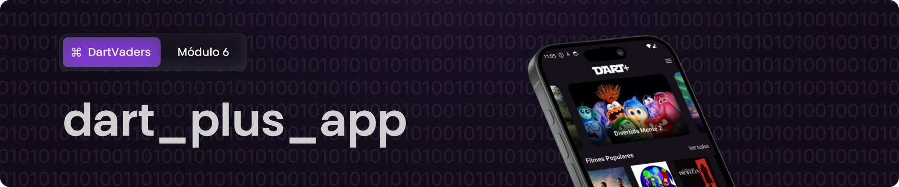

<p align="center">

</p>

<p align="center">
    
    
   
</p>

> [!NOTE]
> Este repositório faz parte do Projeto de Aprendizagem - Módulo 6. A atividade foi realizada no curso de Desenvolvimento Mobile, durante o Programa Desenvolve 2024, do Grupo Boticário em parceria com a Escola Korú.</span>

## Índice
* [Objetivo](#objetivo)
* [Tecnologias usadas](#tecnologias-usadas)
* [Features](#features)
* [Links](#links)
* [Squad DartVaders](#squad-dartvaders)
* [Instalação](#instalação)

## Objetivo
O Dart plus é um aplicativo que oferece aos usuários uma experiência completa para explorar filmes e séries utilizando a API The Movie Database (TMDb). A aplicação permite interações dinâmicas como buscar e visualizar informações detalhadas, favoritar filmes e séries preferidos, filtragem por gênero, possibilitando uma experiência personalizada de acordo com as preferências de cada usuário.

## Tecnologias usadas:
- Flutter
- Dart
- Bloc
- sqflite
- Firebase
- Figma

## Features
* Autenticação do usuário com Firebase
* Navegação e visualização de filmes ou séries populares
* Visualização de detalhes da mídia, incluindo ranking, sinopse e trailer em vídeo
* Recomendações de filmes ou séries similares 
* Visualização de filmes e séries em tendência
* Busca por título 
* Visualização em formato de catálogo e filtragem por gênero
* Gerenciamento de favoritos possibilitando adicionar, remover e visualizar lista de favoritos
* Navegação com menu drawer permitindo acesso a conta e logout
* Offline first
* Implementação responsiva proporcionando uma experiência consistente em diferentes dispositivos


## Links
* [Apresentação disponível no Figma](https://www.figma.com/file/5syuNnFIP2xm7y6V64zP9K/Dart%2B-App?type=design&node-id=171-66&mode=design&t=MkQ5SrPDCfC3utHp-0)
* [APK da aplicaçao]()


## Squad DartVaders 💜
| Emerson Mendes | Erika Alves Malaquias | Franciéllen Sousa | Jaqueline Dreyer | Jhonny Valente | João Rebouças | Kamila Teófilo |  Leidiane Silva | 
|  :---:  |  :---:  |  :---:  |  :---:  |  :---:  |  :---:  |  :---:  |  :---:  |
||||| ||||

## Instalação

Primeiramente você precisa ter instalado o [Flutter SDK](https://docs.flutter.dev/get-started/install) e, em seguida, para realizar o clone do projeto via HTTPS, execute o comando:

```git clone https://github.com/erikabusiness/dart_plus_app.git```

Se você tiver uma chave SSH registrada em sua conta do GitHub, clone o projeto usando este comando:

```git clone git@github.com:erikabusiness/dart_plus_app.git```

Instale as dependências:

```flutter pub get ```

Execute o seguinte comando para iniciar a aplicação em um ambiente de desenvolvimento:

```
// Inicie a aplicação
flutter run main.dart
```

Execute o seguinte comando para rodar os testes de desenvolvimento:

```
// Rode todos testes 
flutter test 
```

