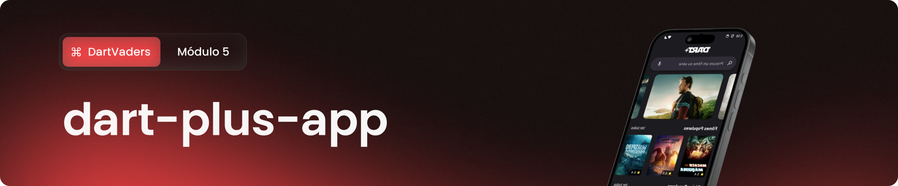
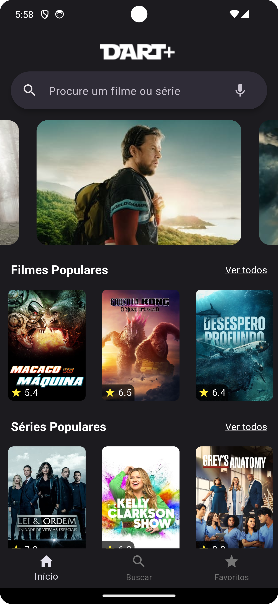
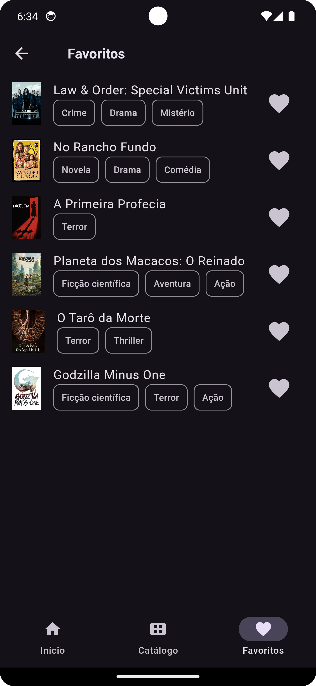
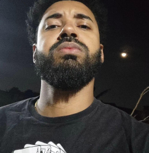

<p align="center">

</p>

<p align="center">
    
</p>

> [!NOTE]
> Este repositório faz parte do Projeto de Aprendizagem - Módulo 5. A atividade foi realizada no curso de Desenvolvimento Mobile, durante o Programa Desenvolve 2024, do Grupo Boticário em parceria com a Escola Korú.</span>

## Índice
* [Objetivo](#objetivo)
* [Tecnologias usadas](#tecnologias-usadas)
* [Features](#features)
* [Links](#links)
* [Squad DartVaders](#squad-dartvaders)
* [Instalação](#instalação)

## Objetivo
O objetivo deste projeto foi desenvolver um aplicativo que oferece aos usuários uma experiência completa para explorar e descobrir filmes e séries populares. Através da integração com a API TMDb, os usuários podem visualizar uma lista atualizada de títulos, bem como acessar informações detalhadas sobre cada um deles. A aplicação permite interações dinâmicas, como favoritar filmes e séries preferidos, além de fornecer a funcionalidade de filtragem por gênero, possibilitando uma experiência personalizada de acordo com as preferências de cada usuário.

## Tecnologias Usadas:
[](https://skillicons.dev)

## Features
* Visualização de filmes e séries populares
* Navegação e visualização dos detalhes de cada filme ou série
* Visualização de filmes e séries vindos de uma API
* Adição de filmes ou séries aos favoritos e seu gerenciamento

#### **Extra:**
* Visualização de filmes e séries em tendência
* Pesquisa por título de filmes ou séries utilizando a SearchBar
* Tratamento de mensagem para o usuário caso não seja encontrado nenhum título de filme ou série não corresponder a nenhum item encontrado
* Visualização de ranking com estrelas
* Visualização de trailer em vídeo 
* Recomendações de filmes ou séries similares 
* Filtragem por gênero
* Persistência de dados com sqflite
* Sistema de Offline First

## Links
* [Apresentação disponível no Figma](https://www.figma.com/file/5syuNnFIP2xm7y6V64zP9K/Dart%2B-App?type=design&node-id=171-66&mode=design&t=MkQ5SrPDCfC3utHp-0)


## Squad DartVaders 💜
| Emerson Mendes | Erika Alves Malaquias | Franciéllen Sousa | Jaqueline Dreyer | Jhonny Valente | João Rebouças | Kamila Teófilo |  Leidiane Silva | 
|  :---:  |  :---:  |  :---:  |  :---:  |  :---:  |  :---:  |  :---:  |  :---:  |
||||| ||||

## Instalação

Primeiramente você precisa ter instalado o [Flutter SDK](https://docs.flutter.dev/get-started/install) e, em seguida, para realizar o clone do projeto via HTTPS, execute o comando:

```git clone https://github.com/erikabusiness/dart_plus_app.git```

Se você tiver uma chave SSH registrada em sua conta do GitHub, clone o projeto usando este comando:

```git clone git@github.com:erikabusiness/dart_plus_app.git```

Execute o seguinte comando para iniciar a aplicação em um ambiente de desenvolvimento:

```
// Inicie a aplicação
dart run main.dart
```

